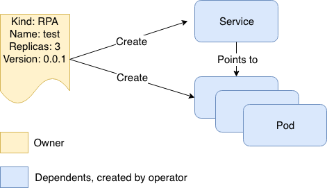

# Random Paragraph Operator

A sample Kubernetes operator that demonstrates how to build an operator with the help of [Kubebuiler](https://github.com/kubernetes-sigs/kubebuilder).

The operator is for a [random paragraph service](https://github.com/richardcase/itsrandom) and it will essentially create a service and pods:

You can follow the implementation in steps using this sequence of branches:

1.  [step-project-setrup](https://github.com/richardcase/itsrandomoperator/tree/step-project-setup)
2. [step-crd](https://github.com/richardcase/itsrandomoperator/tree/step-crd)
3. [step-watch](https://github.com/richardcase/itsrandomoperator/tree/step-watch)
4. [step-reconcile](https://github.com/richardcase/itsrandomoperator/tree/step-reconcile)
5. [step-status](https://github.com/richardcase/itsrandomoperator/tree/step-status)
6. [step-events](https://github.com/richardcase/itsrandomoperator/tree/step-events)
7. [step-deployment](https://github.com/richardcase/itsrandomoperator/tree/step-deployment)
8. [step-leader](https://github.com/richardcase/itsrandomoperator/tree/step-leader)

### Omissions
There are a few areas missing from this sample. Notably:

* CI
* Probes
* Metrics
* Testing
* Webhooks

In the future these may be rectified to give a more complete sample. 